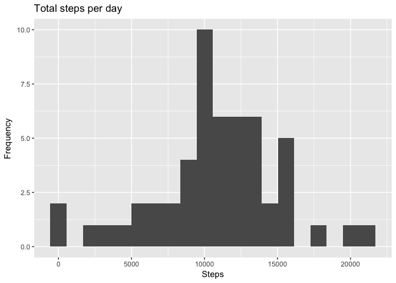
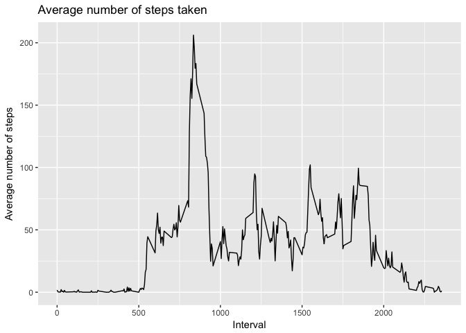
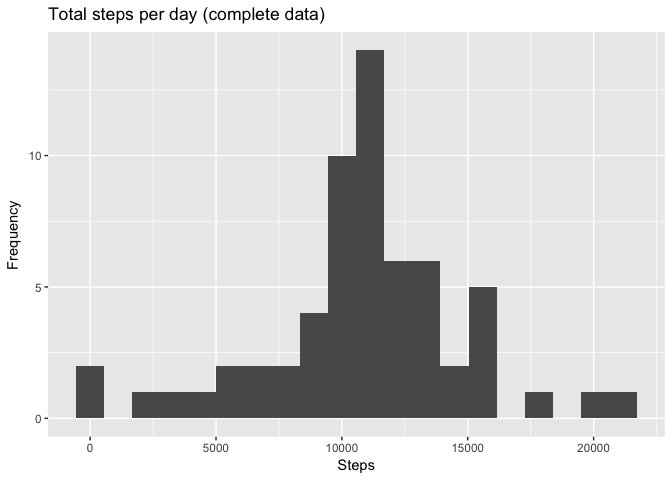
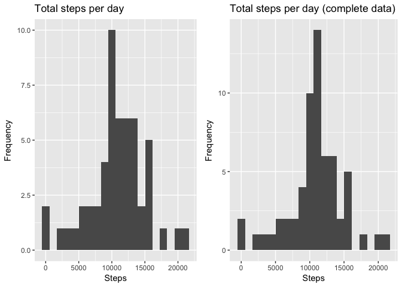
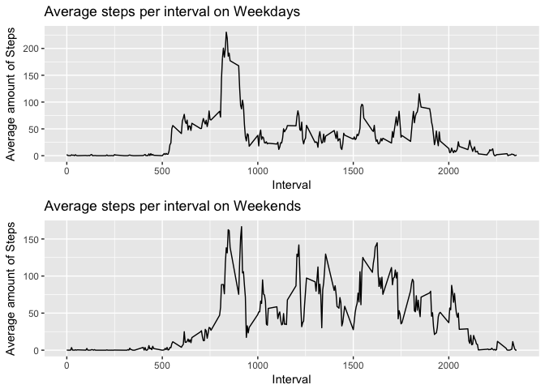

# Peer-Graded Assignment: Course Project

Instructions
-----------------------------------------

Introduction

It is now possible to collect a large amount of data about personal movement using activity monitoring devices such as a Fitbit, Nike Fuelband, or Jawbone Up. These type of devices are part of the “quantified self” movement – a group of enthusiasts who take measurements about themselves regularly to improve their health, to find patterns in their behavior, or because they are tech geeks. But these data remain under-utilized both because the raw data are hard to obtain and there is a lack of statistical methods and software for processing and interpreting the data.

This assignment makes use of data from a personal activity monitoring device. This device collects data at 5 minute intervals through out the day. The data consists of two months of data from an anonymous individual collected during the months of October and November, 2012 and include the number of steps taken in 5 minute intervals each day.

The data for this assignment can be downloaded from the course web site:
Dataset: Activity monitoring data [52K]
https://d396qusza40orc.cloudfront.net/repdata%2Fdata%2Factivity.zip

The variables included in this dataset are:

steps: Number of steps taking in a 5-minute interval (missing values are coded as 𝙽𝙰)
*date: The date on which the measurement was taken in YYYY-MM-DD format
*interval: Identifier for the 5-minute interval in which measurement was taken
The dataset is stored in a comma-separated-value (CSV) file and there are a total of 17,568 observations in this dataset.

Assignment
-----------------------------------------

### Code for reading in the dataset and/or processing the data
Reading in the dataset:

```r
dataset <- read.csv("activity.csv",na.strings = "NA")
```

checking first rows of dataset:

```r
head(dataset)
```

```
##   steps       date interval
## 1    NA 2012-10-01        0
## 2    NA 2012-10-01        5
## 3    NA 2012-10-01       10
## 4    NA 2012-10-01       15
## 5    NA 2012-10-01       20
## 6    NA 2012-10-01       25
```

Summary of dataset:

```r
summary(dataset)
```

```
##      steps                date          interval     
##  Min.   :  0.00   2012-10-01:  288   Min.   :   0.0  
##  1st Qu.:  0.00   2012-10-02:  288   1st Qu.: 588.8  
##  Median :  0.00   2012-10-03:  288   Median :1177.5  
##  Mean   : 37.38   2012-10-04:  288   Mean   :1177.5  
##  3rd Qu.: 12.00   2012-10-05:  288   3rd Qu.:1766.2  
##  Max.   :806.00   2012-10-06:  288   Max.   :2355.0  
##  NA's   :2304     (Other)   :15840
```

### Histogram of the total number of steps taken each day

Calculate total number of steps each day:

```r
steps_per_day <- aggregate(dataset$steps, list(dataset$date), sum)
names(steps_per_day) <- c("Date", "Steps")
head(steps_per_day)
```

```
##         Date Steps
## 1 2012-10-01    NA
## 2 2012-10-02   126
## 3 2012-10-03 11352
## 4 2012-10-04 12116
## 5 2012-10-05 13294
## 6 2012-10-06 15420
```

```r
summary(steps_per_day)
```

```
##          Date        Steps      
##  2012-10-01: 1   Min.   :   41  
##  2012-10-02: 1   1st Qu.: 8841  
##  2012-10-03: 1   Median :10765  
##  2012-10-04: 1   Mean   :10766  
##  2012-10-05: 1   3rd Qu.:13294  
##  2012-10-06: 1   Max.   :21194  
##  (Other)   :55   NA's   :8
```

Plot histogram:

```r
library(ggplot2)
g1 <- ggplot(steps_per_day) + 
    geom_histogram(aes(x= steps_per_day$Steps), bins=20) +
    labs(title ="Total steps per day", x = "Steps", y = "Frequency")
g1
```

```
## Warning: Removed 8 rows containing non-finite values (stat_bin).
```

<!-- -->

### Mean and median number of steps taken each day
Calculate Mean and Median:

```r
mean(steps_per_day$Steps, na.rm = TRUE)
```

```
## [1] 10766.19
```

```r
median(steps_per_day$Steps, na.rm = TRUE)
```

```
## [1] 10765
```

Double Check:

```r
summary(steps_per_day)
```

```
##          Date        Steps      
##  2012-10-01: 1   Min.   :   41  
##  2012-10-02: 1   1st Qu.: 8841  
##  2012-10-03: 1   Median :10765  
##  2012-10-04: 1   Mean   :10766  
##  2012-10-05: 1   3rd Qu.:13294  
##  2012-10-06: 1   Max.   :21194  
##  (Other)   :55   NA's   :8
```

### Time series plot of the average number of steps taken

Calculate the average number of steps for each 5-minute interval:

```r
avg_steps <- aggregate(dataset$steps, list(dataset$interval), mean, na.rm=TRUE)
names(avg_steps) <- c("Interval", "Steps")
```

Plot time series:

```r
g <- ggplot(avg_steps, aes(x = avg_steps$Interval, y = avg_steps$Steps))
g + geom_line() +
    labs(title ="Average number of steps taken", x = "Interval", y = "Average number of steps")
```

<!-- -->

### The 5-minute interval that, on average, contains the maximum number of steps

```r
avg_steps_int <- aggregate(dataset$steps, list(dataset$interval), mean, na.rm=TRUE)
names(avg_steps_int) <- c("Interval", "Steps")
subset(avg_steps_int, Steps == max(avg_steps_int$Steps))
```

```
##     Interval    Steps
## 104      835 206.1698
```

### Code to describe and show a strategy for imputing missing data

Total number of missing values in the dataset:

```r
summary(dataset)
```

```
##      steps                date          interval     
##  Min.   :  0.00   2012-10-01:  288   Min.   :   0.0  
##  1st Qu.:  0.00   2012-10-02:  288   1st Qu.: 588.8  
##  Median :  0.00   2012-10-03:  288   Median :1177.5  
##  Mean   : 37.38   2012-10-04:  288   Mean   :1177.5  
##  3rd Qu.: 12.00   2012-10-05:  288   3rd Qu.:1766.2  
##  Max.   :806.00   2012-10-06:  288   Max.   :2355.0  
##  NA's   :2304     (Other)   :15840
```
The summary shows that in steps there are 2304 missing datapoints.

Strategy for imputing missing data:
Replace NA by the mean for that 5-minute interval


```r
completedDataset <- dataset

for(i in 1:nrow(completedDataset)) {
    if (is.na(completedDataset$steps[i])) {
        ival <- completedDataset$interval[i] 
        newStep <- subset(avg_steps, Interval == ival) 
        completedDataset$steps[i] <- newStep$Steps
    }
} 

summary(completedDataset)
```

```
##      steps                date          interval     
##  Min.   :  0.00   2012-10-01:  288   Min.   :   0.0  
##  1st Qu.:  0.00   2012-10-02:  288   1st Qu.: 588.8  
##  Median :  0.00   2012-10-03:  288   Median :1177.5  
##  Mean   : 37.38   2012-10-04:  288   Mean   :1177.5  
##  3rd Qu.: 27.00   2012-10-05:  288   3rd Qu.:1766.2  
##  Max.   :806.00   2012-10-06:  288   Max.   :2355.0  
##                   (Other)   :15840
```

### Histogram of the total number of steps taken each day after missing values are imputed

Calculate total number of steps each day:

```r
steps_per_day2 <- aggregate(completedDataset$steps, list(dataset$date), sum)
names(steps_per_day2) <- c("Date", "Steps")
head(steps_per_day2)
```

```
##         Date    Steps
## 1 2012-10-01 10766.19
## 2 2012-10-02   126.00
## 3 2012-10-03 11352.00
## 4 2012-10-04 12116.00
## 5 2012-10-05 13294.00
## 6 2012-10-06 15420.00
```

```r
summary(steps_per_day2)
```

```
##          Date        Steps      
##  2012-10-01: 1   Min.   :   41  
##  2012-10-02: 1   1st Qu.: 9819  
##  2012-10-03: 1   Median :10766  
##  2012-10-04: 1   Mean   :10766  
##  2012-10-05: 1   3rd Qu.:12811  
##  2012-10-06: 1   Max.   :21194  
##  (Other)   :55
```

Plot histogram:

```r
g2 <- ggplot(steps_per_day2) + 
    geom_histogram(aes(x= steps_per_day2$Steps), bins = 20) +
    labs(title ="Total steps per day (complete data)", x = "Steps", y = "Frequency")
g2
```

<!-- -->

Comparison:

```r
library(gridExtra)
grid.arrange(g1,g2, ncol=2)
```

```
## Warning: Removed 8 rows containing non-finite values (stat_bin).
```

<!-- -->

### Panel plot comparing the average number of steps taken per 5-minute interval across weekdays and weekends

Identify weekdays and weekend and divide dataset:

```r
completedDataset$date <- as.Date(completedDataset$date)
completedDataset$Weekend <- grepl("S.+",weekdays(completedDataset$date))

WE <- subset(completedDataset, Weekend=="TRUE")
WD <- subset(completedDataset, Weekend=="FALSE")
avg_steps_int_wd <- aggregate(WD$steps, list(WD$interval), mean, na.rm=TRUE)
avg_steps_int_we <- aggregate(WE$steps, list(WE$interval), mean, na.rm=TRUE)
names(avg_steps_int_wd) <- c("Interval", "Steps")
names(avg_steps_int_we) <- c("Interval", "Steps")
```

Plot graphs

```r
gWE <- ggplot(avg_steps_int_we, aes(x = avg_steps_int_we$Interval, y = avg_steps_int_we$Steps)) + 
    geom_line() + 
    labs(title ="Average steps per interval on Weekends", x = "Interval", y = "Average amount of Steps")

gWD <- ggplot(avg_steps_int_wd, aes(x = avg_steps_int_wd$Interval, y = avg_steps_int_wd$Steps)) + 
    geom_line() + 
    labs(title ="Average steps per interval on Weekdays", x = "Interval", y = "Average amount of Steps")

grid.arrange(gWD,gWE, nrow=2)
```

<!-- -->
